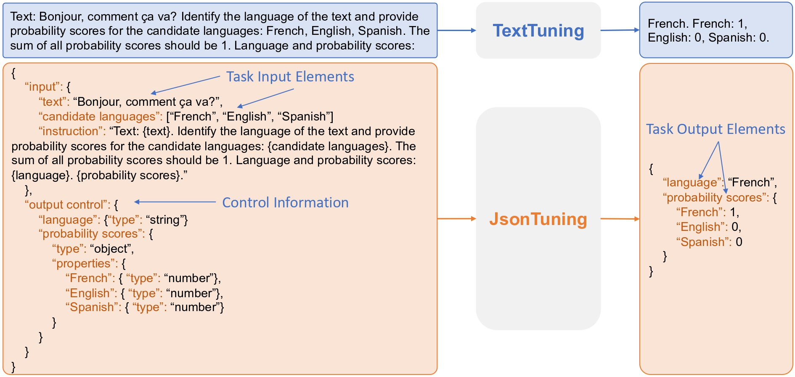

# JsonTuning: Towards Generalizable, Robust, and Controllable Instruction Tuning

Code for JsonTuning.



Instruction tuning has emerged as a crucial process for harnessing the capabilities of large language models (LLMs) by providing explicit task instructions, leading to improved performance in various tasks. However, prevalent text-to-text instruction tuning (TextTuning) methods suffer from limitations in generalization, robustness, and controllability due to the ambiguity and lack of explicit structure in tasks. In this paper, we propose JsonTuning, a novel structure-to-structure approach for instruction tuning. By leveraging the versatility and structured nature of JSON to represent tasks, JsonTuning enhances generalization by helping the model understand essential task elements and their relations, improves robustness by minimizing ambiguity, and increases controllability by providing explicit control over the output. We conduct a comprehensive comparative study with diverse language models and evaluation benchmarks. Experimental results show that JsonTuning outperforms TextTuning in various applications, showcasing improved performance, adaptability, robustness, and controllability. By overcoming the limitations of TextTuning, JsonTuning demonstrates significant potential for more effective and reliable LLMs capable of handling diverse scenarios.

## Environment Setup

Please run the following commands:

``````
conda env create -f JsonTuning.yaml
conda activate JsonTuning
``````

Experiments were conducted using NVIDIA A6000.


## Data Preparation

Please download the processed data [here](https://drive.google.com/file/d/1y-6gtNZCkWmJ2D-ZHAY3GNAsKm7_mPkP/view?usp=sharing) and cache [here](https://drive.google.com/file/d/176ngITJsW7wY6BzUiwEarGuhwV6fqHdg/view?usp=sharing).
Afterwards, please unzip the files to obtain the data folder `jc-data` and cache folder `cache`, respectively. 

The data folder `jc-data` contains the following files:

* `flan2022_50K.json`: FLAN training data with 50K examples

* `ie_5K.json`: IE training data with 5K NER examples and 5K RE examples

* `mmlu.json`: MMLU evaluation examples

* `bbh.json`: BBN evaluation examples

* `ner.json`: NER evaluation examples

* `re.json`: RE evaluation examples

* `ee.json`: EE evaluation examples

* `sql.json`: Nl2SQL evaluation examples

We also provide a large version of FLAN and IE training data [here](https://drive.google.com/file/d/1XMUQY1SnYQ-OYF1jm1jIhDnlv2BN_gL8/view?usp=sharing), including the following files:

* `flan2022_1M.json`: FLAN training data with 1M examples

* `ie_100K.json`: IE training data with 100K NER examples and 100K RE examples


An example of FLAN2022:
```json
{
    "task name": "natural_questions_open:1.0.0",
    "task source": "Flan2021",
    "template": [  // task prompt
        "Answer this question:\n\n{question}?",
        "{answer}"
    ],
    "input_text": "Answer this question:\n\nwho did denver play in their last super bowl??",
    "input_json": {
        "question": "who did denver play in their last super bowl?"
    },
    "output_text": "Carolina Panthers",
    "output_json": {
        "answer": "Carolina Panthers"
    },
    "output features": {  // control information
        "answer": {
            "type": "string"
        }
    }
}
```


## Training and Evaluation
Setup your W&B account following [this tutorial](https://docs.wandb.ai/quickstart).
Afterwards, uncomment the `wandb.init()` and `wandb.config.update()` statements in `JsonTuning.py` and `JsonEvaluation_{task/benchmark}.py` and use your own entity and project names.

For training, please run the following command
``````
bash jsonrun.bash {model} {size} {text_tuning} {device}
``````
Parameters:

* `model`: `falcon`, `llama`, or `llama2`

* `size`:  `7b` or `13b`

* `text_tuning`:  `0` for JsonTuning and `1` for TextTuning

* `device`:  GPU ids for training


For evaluation, please run the following command
``````
bash jsoneval.bash {device} {checkpoint_path} {batch_size} {use_all_templates}
``````

Parameters:

* `device`:  GPU ids for evaluation

* `checkpoint_path`: Model checkpoint for evaluation

* `batch_size`: Batch size per GPU for evaluation

* `use_all_templates`: `0` for using a single task prompt and `1` for using 10 task prompts. Set to `1` for testing robustness of models. 


## Citation
If you find the code helpful, please give this repository a star and cite our paper:

```
@article{gao2023jsontuning,
  title={JsonTuning: Towards Generalizable, Robust, and Controllable Instruction Tuning},
  author={Gao, Chang and Zhang, Wenxuan and Chen, Guizhen and Lam, Wai},
  journal={arXiv preprint arXiv:2310.02953},
  url={https://arxiv.org/abs/2310.02953},
  year={2023}
}
```


